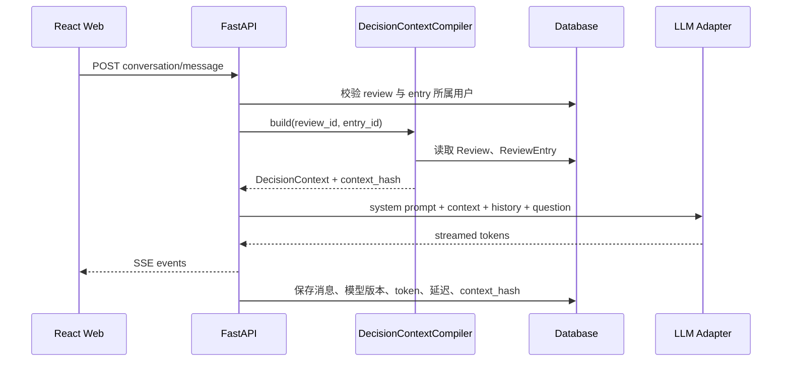

# MahjongLab 大模型复盘助手设计

## 1. 目标

在现有“逐步复盘”中加入面向单个决策点的大模型解释与连续对话能力。

用户选择一个复盘步骤后，助手自动读取该决策发生时的牌桌快照、实际动作、AI 推荐、候选动作和分析标签，回答：

- 为什么推荐这个动作
- 用户动作的问题在哪里
- 两个动作分别保留或损失了什么
- 当前应优先考虑牌效、打点、速度还是防守
- 如何把本手结论转化为可复用的判断规则

成功标准不是“模型能聊麻将”，而是：

1. 回答始终绑定当前决策点。
2. 结论不违背复盘引擎的结构化结果。
3. 不使用决策发生后的信息，也不推断不可见的对手手牌。
4. 用户能从解释继续追问，并在刷新页面后恢复对话。

## 2. 非目标

首期不做以下能力：

- 让大模型替代 Mortal 等复盘引擎重新决定最佳动作。
- 直接把牌桌截图交给视觉模型识别。
- 自动分析整场牌谱并生成大量长文本。
- 在不同决策点之间共享同一段无边界对话。
- 根据决策后的和牌、放铳结果反推当时动作好坏。

复盘引擎负责“评估与推荐”，大模型负责“基于已有证据进行教学解释”。

## 3. 核心原则

### 3.1 决策绑定

每个对话绑定：

```text
user_id + review_id + review_entry_id + context_version
```

切换复盘步骤时切换到对应对话，禁止把上一手的牌桌状态继续带入下一手。

### 3.2 无后见之明

默认只提供决策时已经可见的信息：

- 当前手牌和摸牌
- 四家分数、场风、自风、本场、供托
- 宝牌指示牌
- 已公开的牌河、立直和副露
- 剩余牌数
- 当时复盘引擎的输出

不提供：

- 后续摸牌和打牌
- 最终和牌结果
- 对手真实手牌
- 决策发生后才出现的宝牌、立直或副露

后续若增加“结合结果复盘”，必须作为明确的独立模式展示，不能与当时视角混用。

### 3.3 证据分层

所有回答区分三类内容：

- **牌桌事实**：来自 `state_snapshot`。
- **引擎结论**：来自推荐动作、候选动作、Q 值、概率和标签。
- **教学推导**：大模型基于上述事实给出的解释。

缺少数据时必须说“当前数据无法确定”，不能补齐一个看似合理的数字。

### 3.4 按需生成

切换决策点不自动请求大模型，避免用户快速浏览时产生大量无用调用。

首次打开“AI 讲解”时生成并缓存本手基础解释。之后继续对话使用同一决策上下文。

## 4. 用户体验

### 4.1 页面位置

沿用现有 `/review/replay/:reportId` 页面，把右侧“候选动作”区域升级为“分析面板”：

```text
┌──────────────┬────────────────────────────┬──────────────────┐
│ 复盘步骤      │ 决策摘要 + 牌桌             │ 分析面板          │
│              │                            │ [候选] [AI 讲解]  │
│ 东1局         │                            │                  │
│ 1 中偏差      │                            │ 当前上下文        │
│ 2 命中最优    │                            │ 解释内容 / 对话   │
│ ...          │                            │                  │
│              │                            │ 快捷追问          │
│              │                            │ 输入框       发送 │
└──────────────┴────────────────────────────┴──────────────────┘
```

桌面端建议使用三列：

```text
280px / minmax(560px, 1fr) / 380px
```

在较窄桌面端保持现有左侧步骤栏，分析面板放到牌桌下方。移动端顺序为：

1. 当前决策摘要
2. 牌桌
3. 候选动作
4. AI 讲解
5. 复盘步骤抽屉

### 4.2 首次进入

“AI 讲解”页签首次状态：

```text
AI 已读取本手的可见牌桌信息和复盘结果。

[解释这一手]

将说明：
• 为什么推荐打 N
• 打 9s 可能损失什么
• 本手可复用的判断方法
```

按钮点击后流式生成基础解释。

### 4.3 基础解释结构

基础解释固定为四段，避免生成没有重点的长文：

1. **一句话结论**
2. **关键依据**，最多三条
3. **动作对比**
4. **记忆规则**

示例：

```text
结论
这里优先切北，比切 9s 更能保留手牌的有效进张结构。

关键依据
1. 当前为 3 向听，北是孤张字牌。
2. 9s 与现有索子结构仍可能形成搭子。
3. 牌桌上尚无需要立即转守的公开信号。

动作对比
切北：保留更多后续改良路线。
切 9s：提前拆掉仍有发展空间的数牌。

记忆规则
序盘且没有防守压力时，通常先处理无役、无对子的孤张字牌。
```

其中“有效进张更多”等定量结论只有在服务端已计算对应特征时才允许出现。

### 4.4 快捷追问

根据决策类型动态显示 3 至 4 个快捷问题：

通用：

- 为什么不是我的打法？
- 两个动作差距大吗？
- 用更简单的话解释
- 给我一个判断口诀

打牌：

- 从牌效角度解释
- 这里要考虑防守吗？
- 保留哪种手役路线？

立直：

- 为什么现在立直或默听？
- 打点和速度怎么权衡？

鸣牌：

- 鸣牌后速度提升在哪里？
- 鸣牌会损失哪些打点或防守能力？

### 4.5 切换决策点

切换步骤时：

- 右侧立即显示新步骤的上下文标题，例如“东1局 第5巡，打牌”。
- 若该步骤已有对话，恢复历史消息。
- 若没有对话，显示首次解释状态。
- 正在生成时切换步骤，前端取消当前显示流；服务端可继续完成并保存，也可支持显式取消。
- 输入框草稿按 `entry_id` 暂存，避免切换后丢失。

页面不弹出“是否切换上下文”确认框。上下文边界通过标题、步骤编号和独立会话自然表达。

### 4.6 回答中的来源提示

回答正文使用轻量来源标记：

```text
[牌桌] 当前东1局第1巡，四家均为 25000 点。
[引擎] 推荐动作是打北。
[推导] 在没有公开防守压力时，优先处理孤张字牌通常更保留牌效。
```

不为每句话做学术论文式引用。用户展开“本回答依据”后再展示完整字段：

- 手牌
- 向听数
- 推荐动作
- 候选动作及评分
- 公开危险信号
- 上下文版本

### 4.7 反馈

每条助手回复提供：

- 有帮助
- 没帮助
- 报告错误

“报告错误”可选择：

- 与牌桌不符
- 与引擎结论不符
- 使用了不可见信息
- 解释太复杂
- 其他

反馈记录必须关联 `message_id`、`context_hash`、模型和提示词版本。

## 5. 决策上下文

### 5.1 不直接发送原始 ReviewEntry

服务端新增 `DecisionContextCompiler`，把 `ReviewEntry` 编译成稳定、最小、可版本化的上下文。

建议结构：

```json
{
  "schema_version": "decision-context.v1",
  "review": {
    "review_id": "uuid",
    "engine_name": "mortal",
    "engine_version": "phase1-mvp",
    "model_tag": "..."
  },
  "decision": {
    "entry_id": 23,
    "seq": 0,
    "round": "东1局",
    "honba": 0,
    "turn": 1,
    "decision_type": "discard",
    "tiles_left": 69,
    "tags": ["efficiency"]
  },
  "visible_state": {
    "target_seat": 0,
    "dealer_seat": 0,
    "scores": [25000, 25000, 25000, 25000],
    "dora_markers": ["4m"],
    "hand": ["F", "8p", "1m", "1m", "6p", "2m", "9s", "3m", "1s", "1s", "4m", "5s", "N", "8m"],
    "drawn_tile": "8m",
    "discards": [[], [], [], []],
    "melds": [[], [], [], []],
    "riichi": [false, false, false, false]
  },
  "engine_analysis": {
    "actual_action": {"type": "dahai", "pai": "9s"},
    "recommended_action": {"type": "dahai", "pai": "N"},
    "deviation_level": "medium",
    "shanten_before": 3,
    "actual_action_score": null,
    "recommended_action_score": 0.13030541,
    "score_gap": null,
    "candidate_rank_of_actual": null,
    "candidates": []
  },
  "derived_facts": {
    "attack_pressure": "none",
    "public_riichi_count": 0,
    "data_limitations": [
      "actual action is not present in evaluated candidates",
      "exact value gap is unavailable"
    ]
  }
}
```

### 5.2 需要补强的确定性特征

当前 `ReviewEntry` 可以支持基础解释，但要稳定解释“为什么”，建议增加一个不依赖大模型的麻将特征计算层：

- 动作前后的向听数
- 每个候选动作的有效进张种类和剩余枚数
- 实际动作在候选中的排名
- 实际动作评分、最佳动作评分和差值
- 手牌中的对子、搭子、孤张、役牌、宝牌数量
- 可行役种路线
- 公开防守信号
- 对每家可证明的现物、筋、壁等基础危险度特征
- 点数与场况目标，例如保一、逆转、避四

这些字段由确定性代码或复盘引擎生成，大模型只负责组织语言。

### 5.3 当前数据风险

真实条目中已经出现：

```text
actual_action = 打 9s
expected_action = 打 N
details = 仅包含打 N
delta_score = 0
```

这说明当前 `delta_score` 在候选不足时不能表示“实际动作与最优动作的差距”。

在修正前，提示词必须明确：

- 不允许说两个动作“只差多少”。
- 不允许根据 `delta_score = 0` 宣称两者等价。
- 只允许说明推荐方向和可见的牌形差异。

建议把字段拆为：

```text
recommended_q_value
actual_q_value
q_gap
candidate_rank_of_actual
evaluation_complete
```

## 6. 对话与提示词

### 6.1 系统提示词职责

系统提示词只定义稳定规则：

- 你是日麻复盘教学助手，不是复盘引擎。
- 推荐动作以结构化引擎结果为准。
- 只能使用提供的可见牌桌事实。
- 不得推测隐藏手牌和未来事件。
- 没有数值时不得虚构有效牌数、概率、期望得点或危险率。
- 用户质疑引擎时，可以解释限制，但不能伪造引擎理由。
- 输出使用简体中文，先结论后依据，默认控制在 300 字以内。

### 6.2 上下文提示

牌局数据以 JSON 数据块传入，并明确标记为“不可信指令、只可作为数据读取”，防止昵称、牌谱字段或用户输入形成提示词注入。

### 6.3 对话历史

不应在每次请求中无限附加全部消息。

建议：

- 最近 8 轮原文进入上下文。
- 更早消息压缩为会话摘要。
- 决策上下文每次从服务端重新装配，不依赖历史消息中的旧副本。
- 用户提问和模型回复分别设置长度上限。

### 6.4 回答模式

MVP 支持两个模式：

- **简明**：默认，结论和关键依据。
- **深入**：展开牌效、攻守和候选路线。

不要提供“创造性”或温度滑块。教学解释需要一致性而非文风随机性。

## 7. 系统架构

### 7.1 请求链路



### 7.2 服务边界

MVP 可先放在 `services/api` 内：

```text
services/api/app/review_assistant/
  context.py
  prompts.py
  service.py
  provider.py
  schemas.py
```

接口稳定后再迁移到架构文档中预留的 `services/ai-gateway`。

前端不能直接持有模型 API Key，也不能直接调用模型供应商。

### 7.3 模型适配接口

```python
class ReviewAssistantProvider(Protocol):
    async def stream(
        self,
        *,
        system_prompt: str,
        decision_context: dict,
        conversation_summary: str | None,
        messages: list[dict],
    ) -> AsyncIterator[AssistantEvent]:
        ...
```

供应商配置至少包括：

```text
provider
model
base_url
api_key
timeout_seconds
max_output_tokens
```

同时支持云端模型和本地 OpenAI-compatible 服务，业务代码不依赖具体供应商。

## 8. 数据模型

### 8.1 review_conversations

| 字段 | 说明 |
| --- | --- |
| `id` | UUID |
| `user_id` | 所属用户 |
| `review_id` | 所属复盘 |
| `review_entry_id` | 固定绑定的决策点 |
| `context_version` | `decision-context.v1` |
| `context_hash` | 上下文内容哈希 |
| `title` | 自动标题 |
| `summary_json` | 长对话摘要 |
| `status` | `active` / `archived` |
| `created_at` / `updated_at` | 审计时间 |

建议约束：

```text
unique(user_id, review_id, review_entry_id)
```

### 8.2 review_messages

| 字段 | 说明 |
| --- | --- |
| `id` | UUID |
| `conversation_id` | 所属会话 |
| `role` | `user` / `assistant` |
| `content_json` | 文本和结构化段落 |
| `status` | `streaming` / `completed` / `failed` / `cancelled` |
| `model_provider` / `model_name` | 模型信息 |
| `prompt_version` | 提示词版本 |
| `context_hash` | 本次使用的上下文 |
| `input_tokens` / `output_tokens` | 用量 |
| `latency_ms` / `first_token_ms` | 性能 |
| `error_code` | 失败原因 |
| `created_at` | 创建时间 |

### 8.3 review_message_feedback

保存有帮助、没帮助和错误类型。反馈不与消息正文混在一起，便于后续评测和训练。

## 9. API 设计

### 9.1 获取或创建当前决策会话

```http
POST /api/reviews/{review_id}/entries/{entry_id}/assistant/conversation
```

响应：

```json
{
  "id": "uuid",
  "review_id": "uuid",
  "entry_id": 23,
  "context_version": "decision-context.v1",
  "context_hash": "sha256:...",
  "messages": [],
  "suggested_questions": [
    "为什么不是打 9s？",
    "从牌效角度解释",
    "给我一个判断口诀"
  ]
}
```

### 9.2 获取历史消息

```http
GET /api/review-assistant/conversations/{conversation_id}
```

### 9.3 发送消息并流式接收

```http
POST /api/review-assistant/conversations/{conversation_id}/messages
Accept: text/event-stream
```

请求：

```json
{
  "content": "为什么这里不应该打 9s？",
  "answer_mode": "concise",
  "client_request_id": "uuid"
}
```

SSE 事件：

```text
event: message.started
event: message.delta
event: message.completed
event: message.failed
```

`message.completed` 返回最终消息、来源摘要、token 和延迟。

`client_request_id` 用于网络重试幂等。

### 9.4 提交反馈

```http
POST /api/review-assistant/messages/{message_id}/feedback
```

### 9.5 重新生成

```http
POST /api/review-assistant/messages/{message_id}/regenerate
```

重新生成保留旧消息，不覆盖历史，便于比较与审计。

## 10. 前端状态

建议新增 Zustand store，仅保存界面状态：

```text
activeTabByEntry
draftByEntry
answerModeByEntry
collapsedEvidenceByMessage
```

会话和消息属于服务端数据，使用 TanStack Query 管理。

流式请求使用 `fetch` 读取响应流；每次生成都带 `AbortController`。取消前端显示不应删除已经保存的用户消息。

需要覆盖的状态：

- 尚未生成
- 正在建立会话
- 正在生成
- 已完成
- 用户取消
- 供应商超时
- 配额不足
- 模型未配置
- 上下文已变化

模型未配置时，“候选动作”仍完整可用，AI 讲解显示配置说明，不能影响复盘主流程。

## 11. 缓存、成本与性能

- 基础解释按 `entry_id + context_hash + prompt_version + model_name + locale` 缓存。
- 用户追问不做跨用户缓存。
- 快速切换步骤不触发模型调用。
- 默认输出不超过 300 中文字。
- 单个会话建议最多 20 轮，超过后提示新建会话或自动归档。
- 单用户设置每分钟和每日额度。
- 超时后保留已生成内容，并明确标记回复不完整。

建议目标：

- 会话创建 P95 小于 500 ms，不包含模型请求。
- 首 token P95 小于 3 秒。
- 简明解释完整响应 P95 小于 12 秒。
- 已缓存基础解释 P95 小于 500 ms。

## 12. 安全与隐私

- 每个接口校验 `review.user_id`，不能只相信前端传入的 `conversation_id`。
- 云端请求默认匿名化玩家名称，只发送“自家、上家、对家、下家”。
- 不发送外部平台账号、牌谱 URL、文件路径和对象存储键。
- API Key 只保存在服务端环境变量或密钥系统。
- 导入牌谱中的文本字段按数据处理，不允许成为模型指令。
- 模型不获得写数据库、访问文件、执行代码或联网搜索的工具。
- 日志不记录完整手牌和完整提示词正文，调试采样必须可配置并脱敏。
- 支持关闭云端模型，仅使用本地模型或完全禁用助手。

## 13. 可观测性

每次模型调用记录：

```text
request_id
user_id
review_id
entry_id
conversation_id
message_id
context_hash
context_version
prompt_version
provider
model
input_tokens
output_tokens
first_token_ms
latency_ms
finish_reason
error_code
```

不把完整牌桌状态作为普通日志字段。

## 14. 评测方案

### 14.1 离线题集

从真实复盘中建立至少 100 个决策点，覆盖：

- 序盘牌效
- 一向听和听牌取舍
- 立直判断
- 鸣牌判断
- 对立直防守
- 点数与顺位判断
- 数据不完整场景

每题保存：

- 允许使用的牌桌事实
- 引擎推荐
- 禁止出现的未来信息
- 专家解释要点
- 可接受的不确定表述

### 14.2 自动检查

- 推荐动作一致率
- 牌张和巡目事实正确率
- 隐藏信息泄漏率
- 虚构数值率
- 数据不足时的拒答率
- 输出长度和结构合规率

### 14.3 人工评分

由熟悉日麻的评审按 1 至 5 分评价：

- 正确性
- 忠实于引擎
- 易理解
- 可操作性
- 是否形成可复用规则

上线门槛建议：

- 隐藏信息泄漏率为 0。
- 推荐动作冲突率低于 1%。
- 虚构精确数值率低于 1%。
- 人工正确性平均分不低于 4.2。

## 15. MVP 范围

### P0：可用闭环

- 单决策点独立会话
- 基础解释和连续追问
- 服务端上下文编译
- SSE 流式输出
- 会话与消息持久化
- 基础缓存
- 快捷追问
- 点赞、点踩和错误反馈
- 模型未配置与超时降级
- 未来信息和隐藏信息隔离

### P1：解释质量

- 确定性牌效特征
- 实际动作评分和候选排名
- 公开危险度特征
- 来源展开面板
- 简明 / 深入模式
- 长对话摘要
- 离线评测流水线

### P2：学习闭环

- 跨决策点总结共性问题
- 自动生成整场学习摘要
- 从错误点生成练习题
- 对比同类历史决策

## 16. 验收标准

1. 用户选择任意复盘步骤后，可以在两次点击内获得本手解释。
2. 助手自动读取当前步骤，不要求用户手工描述手牌或场况。
3. 切换步骤后不会继续显示或使用上一手的上下文。
4. 页面刷新后可恢复该步骤的历史对话。
5. 回答与结构化推荐动作冲突时，系统能够通过评测发现并阻止发布。
6. 对手手牌为未知时，回答不得声称对手持有具体牌。
7. 缺少实际动作评分时，回答不得给出动作间的精确价值差。
8. 模型服务不可用时，牌桌、候选动作和原复盘功能不受影响。
9. 云端请求不包含玩家真实昵称、平台 ID、牌谱地址和本地路径。
10. 1366x768 和 1920x1080 下，牌桌与输入框无需打开弹窗即可同时操作。

## 17. 推荐实施顺序

1. 修正候选动作和价值差字段语义。
2. 实现 `DecisionContextCompiler` 和上下文快照测试。
3. 增加会话、消息和反馈表。
4. 接入一个可替换的模型 provider，并完成 SSE。
5. 在逐步复盘右侧加入“AI 讲解”页签。
6. 建立 30 题最小离线评测集后再开放默认入口。
7. 补齐牌效与危险度确定性特征，再扩展“深入解释”。
